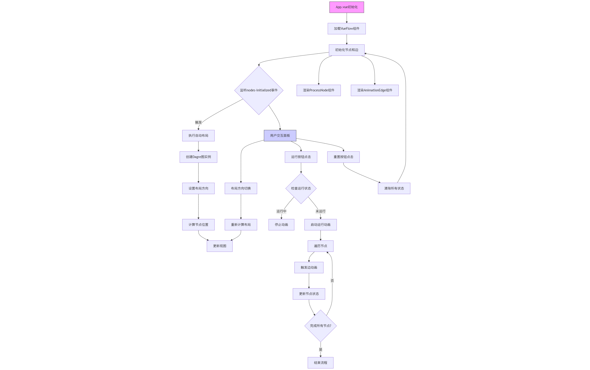

## App.vue的运行逻辑

```flow
flowchart TD
    A[App.vue初始化] --> B[加载VueFlow组件]
    B --> C[初始化节点和边]
    C --> D{监听nodes-initialized事件}
    D --> |触发| E[执行自动布局]
    
    E --> F[创建Dagre图实例]
    F --> G[设置布局方向]
    G --> H[计算节点位置]
    H --> I[更新视图]
    
    C --> J[渲染ProcessNode组件]
    C --> K[渲染AnimationEdge组件]
    
    D --> L[用户交互面板]
    L --> M[运行按钮点击]
    M --> N{检查运行状态}
    N --> |未运行| O[启动运行动画]
    N --> |运行中| P[停止动画]
    
    O --> Q[遍历节点]
    Q --> R[触发边动画]
    R --> S[更新节点状态]
    S --> T{完成所有节点?}
    T --> |是| U[结束流程]
    T --> |否| Q
    
    L --> V[布局方向切换]
    V --> W[重新计算布局]
    W --> I
    
    L --> X[重置按钮点击]
    X --> Y[清除所有状态]
    Y --> C
    
    style A fill:#f9f,stroke:#333
    style L fill:#ccf,stroke:#333
```

App.vue的运行逻辑可以用流程图来表示，其中包含了App.vue初始化、加载VueFlow组件、初始化节点和边、监听nodes-initialized事件、执行自动布局、创建Dagre图实例、设置布局方向、计算节点位置、更新视图、渲染ProcessNode组件、渲染AnimationEdge组件、用户交互面板、运行按钮点击、检查运行状态、启动运行动画、停止动画、遍历节点、触发边动画、更新节点状态、完成所有节点？、结束流程、布局方向切换、重新计算布局、重置按钮点击、清除所有状态等流程。

